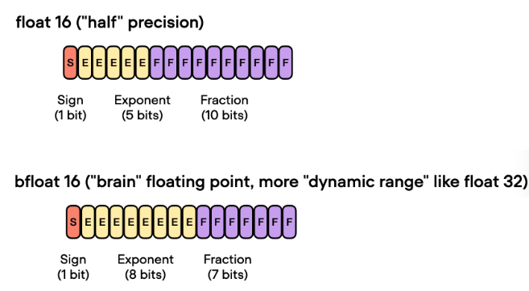
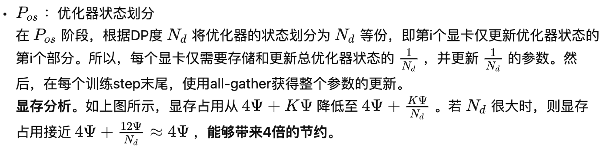

# deepspeed介绍
https://github.com/microsoft/DeepSpeed
https://arxiv.org/abs/1910.02054

## 1. 为什么需要DeepSpeed

- 分布式计算环境中，主节点负责协调其他节点和进程的工作
- 混合精度训练
ZeRO可以减少内存占用，优化大模型训练，将模型参数分成了三个部分：Optimizer States、Gradient 和 Model Parameter。在使用 ZeRO 进行分布式训练时，可以选择 ZeRO-Offload 和 ZeRO-Stage3 等不同的优化技术。

### 简介
DeepSpeed是一个由微软开发的开源深度学习优化库，旨在**提高大规模模型训练的效率和可扩展性**。它通过多种技术手段来加速训练，包括模型并行化、梯度累积、动态精度缩放、本地模式混合精度等。DeepSpeed还提供了一些辅助工具，如分布式训练管理、内存优化和模型压缩等，以帮助开发者更好地管理和优化大规模深度学习训练任务。此外，deepspeed基于pytorch构建，只需要简单修改即可迁移。DeepSpeed已经在许多大规模深度学习项目中得到了应用，包括语言模型、图像分类、目标检测等等。

### 软件架构
1. Apis：提供易用的api接口，训练模型、推理模型只需要简单调用几个接口即可。其中最重要的是initialize接口，用来初始化引擎，参数中配置训练参数及优化技术等。配置参数一般保存在config.json文件中。
2. runtime：运行时组件，是deepspeed管理、执行和性能优化的核心组件。如部署训练任务到分布式设备、数据分区、模型分区、系统优化、微调、故障检测、checkpoints保存和加载等。该组件使用python语言实现。
3. ops：用c++和cuda实现底层内核，优化计算和通信，例如ultrafast transformer kernels, fuse LAN kernels, customary deals等。


## **2. Zero(Zero Redundancy Optimizer)**

微软开发ZeRO是为了克服数据并行性和模型并行性的限制，同时实现两者的优点。**ZeRO通过在数据并行进程中划分模型状态（参数，梯度和优化器状态），而不是复制它们，从而消除了数据并行进程中的内存冗余。它在训练期间使用动态通信计划，以在分布式设备之间共享必要的状态，以保持计算粒度和数据并行性的通信量**\*\*。\*\*&#x20;

ZeRO驱动的数据并行性，它允许每个设备的内存使用量随数据并行性的程度线性扩展，并产生与数据并行性相似的通信量。 ZeRO支持的数据并行性可以适合任意大小的模型，只要**聚合的设备内存足够大以共享模型状态**即可。

ZeRO是一种用于大规模训练优化的技术，主要是用来减少内存占用。在大规模训练中，内存占用可以分为 Model States 和 Activation 两部分，而 ZeRO 主要是为了解决 Model States 的内存占用问题。

ZeRO 将模型参数分成了三个部分：Optimizer States、Gradient 和 Model Parameter。

-   `Optimizer States` 是 Optimizer 在进行梯度更新时所需要用到的数据，例如 SGD 中的 Momentum。
-   `Gradient `是在反向传播后所产生的梯度信息，其决定了参数的更新方向。
-   `Model Parameter` 则是模型参数，也就是我们在整个过程中通过数据“学习”的信息。


### **2.1 三个级别**

`ZeRO-0`：禁用所有类型的分片，仅使用 DeepSpeed 作为 DDP (Distributed Data Parallel)

`ZeRO-1`：分割Optimizer States，减少了4倍的内存，通信容量与数据并行性相同

`ZeRO-2`：分割Optimizer States与Gradients，8x内存减少，通信容量与数据并行性相同

`ZeRO-3`：分割Optimizer States、Gradients与Parameters，内存减少与数据并行度和复杂度成线性关系。

`ZeRO-Infinity`是ZeRO-3的拓展。允许通过使用 NVMe 固态硬盘扩展 GPU 和 CPU 内存来训练大型模型。ZeRO-Infinity 需要启用 ZeRO-3。

在deepspeed中通过zero\_optimization.stage=0/1/2/3 设置，

卸载通过zero\_optimization.offload\_ optimizer.device设置

### **2.2 混合精度**

混合精度训练是指在训练过程中同时使用FP16（半精度浮点数）和FP32（单精度浮点数）两种精度的技术。**使用FP16可以大大减少内存占用，从而可以训练更大规模的模型**。但是，**由于FP16的精度较低，训练过程中可能会出现梯度消失和模型不稳定的问题**。因此，需要使用一些技术来解决这些问题，例如\*\*动态精度缩放（Dynamic Loss Scaling）**和**混合精度优化器（Mixed Precision Optimizer）\*\*等。


deepspeed提供了混合精度训练的支持，可以通过在配置文件中设置`"fp16.enabled": true`来启用混合精度训练。在训练过程中，deepspeed会自动将一部分操作转换为FP16格式，并根据需要动态调整精度缩放因子，从而保证训练的稳定性和精度。

在使用混合精度训练时，需要注意一些问题，例如梯度裁剪（Gradient Clipping）和学习率调整（Learning Rate Schedule）等。梯度裁剪可以防止梯度爆炸，学习率调整可以帮助模型更好地收敛。因此，在设置混合精度训练时，需要根据具体情况进行选择和配置。


**BF16**

**BF16和FP16都是混合精度训练中使用的浮点数表示格式**。



BF16是一种Brain Floating Point格式，可以提供更好的数值稳定性和更高的精度，使用的存储空间和`float16`相同。在混合精度训练中，**BF16可以作为一种精度更高的替代品，用于一些关键的计算操作，例如梯度累加和权重更新等**。使用BF16可以提高模型的训练速度和精度，并减少内存占用。

在 DeepSpeed 中，可以通过在配置文件中设置 `"bf16.enabled": true` 来启用 BF16 混合精度训练。这将会将一部分操作转换为 BF16 格式，并根据需要动态调整精度缩放因子，从而提高模型的训练速度和精度，并减少内存占用。


### **2.3 显存占用分析**

混合精度训练是指存在fp16和fp32两种格式的数值，其中模型参数、模型梯度都是fp16，此外还有fp32的模型参数，如果优化器是Adam，则还有fp32的momentum和variance。

总的来说，模型训练时显存主要分为两部分。

-   **第一部分**是模型权重、梯度和优化器状态；
-   **第二部分**是激活和临时缓存区。

**ZeRO-DP主要是优化第一部分的显存占用，所以这里主要介绍第一部分的显存。**&#x20;


-   **将权重转换为FP16**：在这一步中，神经网络的权重（或参数）最初是FP32格式，被转换为低精度的FP16格式。这减少了内存的占用，并允许更快的计算，因为FP16操作需要更少的内存，并且可以被硬件更快地处理。 &#x20;
-   **计算梯度**：神经网络的前向和后向传播是使用较低精度的FP16权重进行的。这一步计算损失函数相对于网络权重的梯度（部分导数），在优化过程中用于更新权重。
-   **将梯度转换为FP32**：在FP16中计算梯度后，它们被转换回高精度的FP32格式。这种转换对于保持数值稳定性和避免使用低精度算术时可能出现的梯度消失或爆炸等问题至关重要。 &#x20;
-   **乘以学习率和更新权重**：现在是FP32格式，梯度被乘以学习率（一个标量值，决定了优化过程中的步长）。乘积被用来更新原始FP32神经网络权重。学习率有助于控制优化过程的收敛性，对于实现良好的性能至关重要。

#### （1）**模型状态**（model states）

假设模型的参数量是 $Ψ$ ，使用Adam为优化器进行混合精度训练。

1.  由于模型的参数和梯度使用float16，所以显存消耗分别为 $2Ψ$ 和 $2Ψ$ 。
2.  Adam会维护一个float32的模型备份副本，消耗 $4Ψ$ 显存。Adam优化器本身会为模型的每个参数维护两个float32的辅助变量（fp32的momentum和fp32的variance），所以显存消耗占用为 $4Ψ+4Ψ$ 。

总的来说，模型会消耗 $2Ψ+2Ψ=4Ψ$ ，Adam优化器这消耗$ 4Ψ+4Ψ+4Ψ=12Ψ $。最终的总消耗为 $4Ψ+12Ψ=16Ψ $。


\*\*优化器显存占用表示为 **$KΨ$** (不同的优化器不同)，混合精度训练的显存占用为 **$4Ψ+KΨ$** 。 \*\*

来看一个例子，**qwen2.5-0.5B**含有0.5B个参数，如果用fp16格式，只需要`0.5G*2Byte=1GB`显存

但是模型状态实际上(使用adam优化器)需要耗费`0.5*16=8GB`, 相比之下，激活值可以用[activation checkpointing](https://arxiv.org/pdf/1604.06174.pdf "activation checkpointing")来大大减少，所以模型状态就成了头号显存杀手，它也是ZeRO的重点优化对象。而其中Adam状态又是第一个要被优化的。

比如说有一个模型参数量是1M，在一般的深度学习框架中(比如说PyTorch)，一般是32位存储。32位存储的意思就是1个参数用32个bit来存储。那么这个拥有1M参数量的模型所需要的存储空间的大小即为：1M \* 32 bit = 32Mb = 4MB。因为1 Byte = 8 bit。现在的quantization技术就是减少参数量所占的位数：比如我用16位存储，那么：所需要的存储空间的大小即为：1M \* 16 bit = 16Mb = 2MB。


## **3.ZeRO-DP**

ZeRO-DP(Zero Redundancy Optimizer-Data Parallelism)是来自于论文《ZeRO: Memory Optimizations Toward Training Trillion Parameter Models》中的一种显存优化方法ZeRO的核心部分。通过该方法可以大幅度的优化显存占用，**从而在有限的资源下训练更大的模型**。

针对模型状态的存储优化（去除冗余），ZeRO使用的方法是分片（partition），即每张卡只存 1/N的模型状态量，这样系统内只维护一份模型状态。

**这里os指的是optimizer**


这个概念和一般的DP的差别，只是没有每个 GPU 都复制完整的模型参数、梯度和优化器状态，而是每个 GPU 只存储其中的一部分。在随后的运行过程中，当需要给定层的完整层参数时，所有 GPU 同步以相互提供它们缺失的部分 —— 仅此而已。

第二列给出了一个示例：$  K=12,Ψ=7.5B,N=64  $可以看到显存优化相当明显。

在标准的数据并行中，每个显卡(rank)都会保存独立的**权重、梯度和优化器状态**，如上图中的baseline所示。那么每个显卡是否有必要存储全部的这些信息呢？**ZeRO-DP的答案是不需要**。ZeRO-DP能够对模型状态(权重、梯度和优化器状态)进行划分(不像标准DP那样进行复制)，然后通过动态通信调度来最小化通信开销。ZeRO-DP能够在保持整体通信开销接近标准DP的同时，线性地降低模型的**单显卡**显存占用。

### **3.1 ZeRO-DP的细节**

总的来说，ZeRO-DP可以分为三个阶段：**Pos, Pg, Pp** 。三个阶段对应优化器状态划分、梯度划分和模型参数划分，并且三个阶段可以叠加使用(上图展示了三个阶段的叠加)。关于三个阶段是否会增加通信量，会在后面分析，目前先接受这三个阶段并不会显著增加通信开销。


- **all-gather**
**通信量： $Ψ$**：
基本定义
All-Gather 操作将分布在不同进程上的数据片段收集起来，并将完整的数据集复制到每个进程上。
工作原理
假设有 N 个进程，每个进程拥有一个数据片段：
每个进程将自己的数据片段发送给所有其他进程
每个进程接收来自所有其他进程的数据片段
每个进程将收到的所有片段按照进程编号顺序组合成完整的数据集


- **reduce-scatter** **通信量： $Ψ$**:
基本定义
Reduce-Scatter 操作将每个进程上的数据先进行归约（如求和），然后将结果分散到所有进程上，使每个进程只获得最终结果的一部分。
工作原理
假设有 N 个进程，每个进程都有一个大小为 N 的数组：
Reduce 阶段：对所有进程中相同位置的元素执行归约操作（通常是求和）
Scatter 阶段：将归约结果分散，使第 i 个进程获得归约结果的第 i 个部分


在DeepSpeed中，一般使用ZeRO-1就足够了。


### 3.2 **ZeRO-DP通信量**

ZeRO通过去除显存的冗余来提升模型尺寸，那么该方法是否是通过通信量换取的显存效率。换句话说，ZeRO-DP相较于标准DP来说，通信量增大了吗？

答案分为两部分：

1.  **ZeRO-DP在使用** Pos **和** Pg**的情况下，能够带来8倍的显存降低且不增加额外的通信量；**
2.  **当同时使用** Pos **、** Pg **和**Pp**时，通信量增加1.5倍，同时降低倍的显存。**&#x20;

在分析之前，我们先回顾下常用的集合通信（collective communication）函数[Collective Operations](https://docs.nvidia.com/deeplearning/nccl/user-guide/docs/usage/collectives.html "Collective Operations")。

#### **（1）标准数据并行的通信量**

在标准的数据并行训练中，在反向传播结束后，跨显卡的梯度会被平均。这个平均的过程使用all-reduce。对于大尺寸的模型，all-reduce通信是整个通信带宽的上界，因此分析主要集中在all-reduce上。

传统数据数据并行在每一步（step/iteration）计算梯度后，需要进行一次AllReduce操作来计算梯度均值，目前常用的是Ring AllReduce，分为ReduceScatter和AllGather两步，每张卡的通信数据量（发送+接受）。总的来说，单个显卡在reduce-scatter或者all-gather的过程中，都会有 Ψ 的通信量。那么，整个all-reduce的单显卡通信量为 2Ψ 。

参考：[\[深度学习\]Ring All-reduce的数学性质-CSDN博客](https://zengwenqi.blog.csdn.net/article/details/130501965 "\[深度学习]Ring All-reduce的数学性质-CSDN博客")

#### **（2）Zero-DP的通信量**

Pos**的通信量**

在单独使用 Pos的情况下，单个显卡会保存完整的模型参数和梯度。随后使用reduce-scatter将梯度reduce至不同的显卡上(**此时不同显卡仅拥有完整平均梯度的一部分**)，该步骤的通信量是 Ψ 。各个显卡使用部分梯度更新对应的优化器状态，然后再更新对应的参数(**此时每个显卡上的模型都更新了一部分参数**)。最后，使用all-gather将分布在各个显卡上的更新后参数分发自所有显卡上(**此时所有显卡上都有了完整的更新后参数**)，该步骤的通信量是 Ψ 。总的来说，各个显卡仅需要持有部分优化器状态即可，且总的通信量仍然是 2Ψ 。

## **4.DeepSpeed训练**

### 4.1 基本训练的介绍

安装 DeepSpeed：

```bash
pip install deepspeed

```

1.  在训练脚本中导入 DeepSpeed 模块：
2.  在训练脚本中导入 Trainer 模块：
3.  创建 Trainer 对象，将模型、训练数据集、优化器等参数传入：

```python
import deepspeed
 
from transformers import Trainer
 
trainer = Trainer(
    model=model,
    args=args,
    train_dataset=train_dataset,
    data_collator=data_collator,
    optimizer=optimizer,
)
trainer.train()
```

1.  使用 DeepSpeed 命令行工具运行训练脚本（单机）：

```bash
deepspeed --num_gpus=8 train.py

```

其中，`--num_gpus` 表示使用的 GPU 数量。

多节点：

```bash
deepspeed  --hostfile=hostfile  --master_port 60000 --include="node1:0,1,2,3@node2:0,1,2,3" run.py \
--deepspeed ds_config.json
```

**hostfile**

增加hostfile文件，填写host的相应的gpu数量(slots=4代表有4个gpu)

```bash
node1_ip slots=4
node2_ip slots=4
```

include参数，指定机器和gpu,如下代表使用host1机器的3号和host2的2、3号gpu

**ds\_config.json**

```json
{
    "fp16": {
        "enabled": true,
        "loss_scale": 0,
        "loss_scale_window": 1000,
        "initial_scale_power": 16,
        "hysteresis": 2,
        "min_loss_scale": 1
    },
 
    "optimizer": {
        "type": "AdamW",
        "params": {
            "lr": 3e-5,
            "betas": [0.8, 0.999],
            "eps": 1e-8,
            "weight_decay": 3e-7
        }
    },
 
    "scheduler": {
        "type": "WarmupLR",
        "params": {
            "warmup_min_lr": 0,
            "warmup_max_lr": 3e-5,
            "warmup_num_steps": 500
        }
    },
 
    "zero_optimization": {
        "stage": 3,
        "offload_optimizer": {
            "device": "cpu",
            "pin_memory": true
        },
        "offload_param": {
            "device": "cpu",
            "pin_memory": true
        },
        "overlap_comm": true,
        "contiguous_gradients": true,
        "sub_group_size": 1e9,
        "reduce_bucket_size": 1e6,
        "stage3_prefetch_bucket_size": 0.94e6,
        "stage3_param_persistence_threshold": 1e4,
        "stage3_max_live_parameters": 1e9,
        "stage3_max_reuse_distance": 1e9,
        "stage3_gather_16bit_weights_on_model_save": true
    },
 
    "steps_per_print": 2000,
    "wall_clock_breakdown": false
}
```

### 4.2 训练实战介绍

#### （1）预处理和Json文件

首先是利用huggingface的datasets.map对数据集的样本自定义操作；transformers可以通过trainer集成deepspeed功能，这种用法需要提供配置文件，如下面的deepspeed配置文件ds\_config.json文件。关于这个config具体配置可参考文档。 &#x20;

这里用的FLAN-T5模型；启动deepspeed：deepspeed --include=localhost:1,2 [train.py](http://train.py "train.py")，启动前两张显卡；注意使用ZeRO3需要有足够的内存 &#x20;

如果不使用trianer来集成deepspeed，from\_pretrained和 from\_config这样的核心功能应该包含DeepSpeed中的重要部分，例如zero。初始化Zero的时候应该为stage3或者更高。参考文档。 &#x20;

```json
{
  "bf16": {
    "enabled": "auto"
  },
  "optimizer": {
    "type": "AdamW",
    "params": {
      "lr": "auto",
      "betas": "auto",
      "eps": "auto",
      "weight_decay": "auto"
    }
  },
  "scheduler": {
    "type": "WarmupLR",
    "params": {
      "warmup_min_lr": "auto",
      "warmup_max_lr": "auto",
      "warmup_num_steps": "auto"
    }
  },
  "zero_optimization": {
    "stage": 3,
    "offload_optimizer": {
      "device": "cpu",
      "pin_memory": true
    },
    "offload_param": {
      "device": "cpu",
      "pin_memory": true
    },
    "overlap_comm": true,
    "contiguous_gradients": true,
    "sub_group_size": 1e9,
    "reduce_bucket_size": "auto",
    "stage3_prefetch_bucket_size": "auto",
    "stage3_param_persistence_threshold": "auto",
    "stage3_max_live_parameters": 1e9,
    "stage3_max_reuse_distance": 1e9,
    "stage3_gather_16bit_weights_on_model_save": false
  },
  "gradient_accumulation_steps": "auto",
  "gradient_clipping": "auto",
  "steps_per_print": 2000,
  "train_batch_size": "auto",
  "train_micro_batch_size_per_gpu": "auto",
  "wall_clock_breakdown": false
}
```

#### （2）训练代码

-   数据：samsum数据集
-   模型：google/flan-t5-xxl大模型

```python
# !/usr/bin/python
# -*- coding: utf-8 -*-
 
import nltk
import torch
import evaluate
import datasets
import numpy as np
from nltk.tokenize import sent_tokenize
from torch.utils.data import DataLoader
from torch.nn.utils.rnn import pad_sequence
from transformers import AutoTokenizer, AutoModelForSeq2SeqLM
from transformers import Seq2SeqTrainer, Seq2SeqTrainingArguments
 
nltk.download("punkt")
 
dataset_name = "samsum" # 数据集名称
model_name="google/flan-t5-xxl" # 模型名称
max_input_length = 512
max_gen_length = 128
output_dir = "checkpoints"
num_train_epochs = 5
learning_rate = 5e-5
deepspeed_config = "./ds_config.json" # deepspeed配置文件
per_device_train_batch_size=1 # batch size设置为1，因为太大导致OOM
per_device_eval_batch_size=1
gradient_accumulation_steps=2 # 由于单卡的batch size为1，为了扩展batch size，使用梯度累加
 
tokenizer = AutoTokenizer.from_pretrained(model_name)
 
# 加载数据
dataset = datasets.load_dataset(dataset_name)
print(dataset["train"][0])
 
# tokenize
def preprocess(examples):
    dialogues = ["summarize:" + dia for dia in examples["dialogue"]]
    # summaries = [summ for summ in examples["summary"]]
    model_inputs = tokenizer(dialogues, max_length=max_input_length, truncation=True)
    labels = tokenizer(text_target=examples["summary"], max_length=max_gen_length, truncation=True)
    model_inputs["labels"] = labels["input_ids"]
    return model_inputs
 
tokenized_dataset = dataset.map(preprocess, batched=True, remove_columns=["dialogue", "summary", "id"])
# print(tokenized_dataset["train"]["input_ids"][0]) # 打印结果
 
 
# 对batch进行padding
def collate_fn(features):
    batch_input_ids = [torch.LongTensor(feature["input_ids"]) for feature in features]
    batch_attention_mask = [torch.LongTensor(feature["attention_mask"]) for feature in features]
    batch_labels = [torch.LongTensor(feature["labels"]) for feature in features]
 
    batch_input_ids = pad_sequence(batch_input_ids, batch_first=True, padding_value=tokenizer.pad_token_id)
    batch_attention_mask = pad_sequence(batch_attention_mask, batch_first=True, padding_value=0)
    batch_labels = pad_sequence(batch_labels, batch_first=True, padding_value=-100)
 
    return {
        "input_ids": batch_input_ids,
        "attention_mask": batch_attention_mask,
        "labels": batch_labels
    }
# 用于测试的代码
# dataloader = DataLoader(tokenized_dataset["test"], shuffle=False, batch_size=4, collate_fn=collate_fn)
# batch = next(iter(dataloader))
# print(batch)
 
 
# 加载模型
model = AutoModelForSeq2SeqLM.from_pretrained(model_name)
# 用于测试的代码
# dataloader = DataLoader(tokenized_dataset["test"], shuffle=False, batch_size=4, collate_fn=collate_fn)
# batch = next(iter(dataloader))
# output = model(**batch)
# print(output)
 
 
# 定义评估函数
metric = evaluate.load("rouge")
 
def compute_metrics(eval_preds):
    preds, labels = eval_preds
    if isinstance(preds, tuple):
        preds = preds[0]
    decoded_preds = tokenizer.batch_decode(preds, skip_special_tokens=True)
    labels = np.where(labels != -100, labels, tokenizer.pad_token_id)
    decoded_labels = tokenizer.batch_decode(labels, skip_special_tokens=True)
    decoded_preds = ["\n".join(sent_tokenize(pred.strip())) for pred in decoded_preds]
    decoded_labels = ["\n".join(sent_tokenize(label.strip())) for label in decoded_labels]
    result = metric.compute(predictions=decoded_preds, references=decoded_labels, use_stemmer=True)
    result = {k: round(v * 100, 4) for k, v in result.items()}
    prediction_lens = [np.count_nonzero(pred != tokenizer.pad_token_id) for pred in preds]
    result["gen_len"] = np.mean(prediction_lens)
    return result
 
 
# 设置训练参数
training_args = Seq2SeqTrainingArguments(
    output_dir=output_dir,
    per_device_train_batch_size=per_device_train_batch_size,
    per_device_eval_batch_size=per_device_eval_batch_size,
    gradient_accumulation_steps=gradient_accumulation_steps,
    eval_accumulation_steps=1, # 防止评估时导致OOM
    predict_with_generate=True,
    fp16=False,
    learning_rate=learning_rate,
    num_train_epochs=num_train_epochs,
    # logging & evaluation strategies
    logging_dir="logs",
    logging_strategy="steps",
    logging_steps=50, # 每50个step打印一次log
    evaluation_strategy="steps",
    eval_steps=500, # 每500个step进行一次评估
    save_steps=500,
    save_total_limit=2,
    load_best_model_at_end=True,
    deepspeed=deepspeed_config, # deepspeed配置文件的位置
    report_to="all"
)
 
 
# 模型训练
trainer = Seq2SeqTrainer(
    model=model,
    args=training_args,
    train_dataset=tokenized_dataset["train"],
    eval_dataset=tokenized_dataset["validation"],
    data_collator=collate_fn,
    compute_metrics=compute_metrics,
)
 
trainer.train()
# 打印验证集上的结果
print(trainer.evaluate(tokenized_dataset["validation"]))
# 打印测试集上的结果
print(trainer.evaluate(tokenized_dataset["test"]))
# 保存最优模型
trainer.save_model("best")
```

加速训练方法：量化[工具包](https://so.csdn.net/so/search?q=工具包\&spm=1001.2101.3001.7020 "工具包")bitsandbytes、deepspeed（先读torch.distributed和ColossalAI在搞）、llama.cpp量化模型

### 4.3 deepspeed加速Bloom lora微调

#### （1）配置文件

```json
{
  "train_micro_batch_size_per_gpu": "auto",
  "gradient_accumulation_steps": "auto",
  "steps_per_print": 50,
  "gradient_clipping": 1.0,
  "zero_optimization": {
    "stage": 2,
    "offload_optimizer": {
            "device": "cpu"
    },
    "contiguous_gradients": true,
    "overlap_comm": true
  },
  "zero_allow_untested_optimizer": true,
  "fp16": {
    "enabled": true,
    "loss_scale": 0,
    "loss_scale_window": 1000,
    "hysteresis": 2,
    "min_loss_scale": 1
  },
  "optimizer": {
    "type": "Adam",
    "params": {
      "lr": "auto",
      "betas": "auto",
      "eps": "auto",
      "weight_decay": "auto"
    }
  },
  "activation_checkpointing": {
    "partition_activations": true,
    "contiguous_memory_optimization": true
  },
  "wall_clock_breakdown": false
}
```

#### （2）训练代码

-   数据：使用BELLE提供的100万条指令微调数据
-   模型：bloomz-7b1-mt模型

`deepspeed --include=localhost:0,1,2,3 train.py`启动

```python
#!/usr/bin/env python
# -*- coding: utf-8 -*-
 
import os
import torch
import random
import datasets
import numpy as np
from tqdm import tqdm
from typing import Dict
from torch.utils.data import DataLoader
from transformers import (
    AutoModelForCausalLM,
    AutoTokenizer,
    DataCollatorForSeq2Seq,
    TrainingArguments,
    Trainer
)
from peft import (
    LoraConfig,
    TaskType,
    get_peft_model,
    get_peft_model_state_dict,
    set_peft_model_state_dict
)
 
def set_random_seed(seed):
    if seed is not None and seed > 0:
        random.seed(seed)
        np.random.seed(seed)
        torch.manual_seed(seed)
        torch.random.manual_seed(seed)
        torch.cuda.manual_seed(seed)
        torch.cuda.manual_seed_all(seed)
        torch.backends.cudnn.deterministic = True
 
set_random_seed(1234)
 
# 1. 设置参数
# LoRA参数
LORA_R = 8
LORA_ALPHA = 32
LORA_DROPOUT = 0.1
# 训练参数
EPOCHS=3
LEARNING_RATE=5e-5
OUTPUT_DIR="./checkpoints"
BATCH_SIZE=4 # 2
GRADIENT_ACCUMULATION_STEPS=3
# 其他参数
MODEL_PATH = "bigscience/bloomz-7b1-mt"
DATA_PATH = "./data/belle_open_source_1M.train.json"
MAX_LENGTH = 512
PATTERN = "{}\n{}"
DS_CONFIG = "ds_zero2_config.json"
tokenizer = AutoTokenizer.from_pretrained(MODEL_PATH) # 加载tokenizer
# 加载数据
dataset = datasets.load_dataset("json", data_files=DATA_PATH)
# print(dataset["train"][0])
 
 
# 2. tokenize
def tokenize(text: str, add_eos_token=True):
    result = tokenizer(
        text,
        truncation=True,
        max_length=MAX_LENGTH,
        padding=False,
        return_tensors=None)
    # 判断是否要添加eos_token
    if (result["input_ids"][-1] != tokenizer.eos_token_id
        and len(result["input_ids"]) < MAX_LENGTH
        and add_eos_token):
        result["input_ids"].append(tokenizer.eos_token_id)
        result["attention_mask"].append(1)
    result["labels"] = result["input_ids"].copy()
    return result
 
 
def preprocess(example: Dict, train_on_inputs: bool = False):
    prompt = example["input"]
    response = example["target"]
    text = PATTERN.format(prompt, response)
    tokenized_inp = tokenize(text)
    # 若train_on_inputs为False，则将label中与input相关的token替换为-100
    if not train_on_inputs:
        tokenized_prompt = tokenize(prompt,add_eos_token=False)
        prompt_tokens_len = len(tokenized_prompt["input_ids"])
        tokenized_inp["labels"] = [-100]*prompt_tokens_len + tokenized_inp["labels"][prompt_tokens_len:]
    return tokenized_inp
 
 
train_data = dataset["train"].shuffle().map(preprocess, remove_columns=["id", "input", "target"])
print(train_data[0])
 
# pad_to_multiple_of=8表示padding的长度是8的倍数
collate_fn = DataCollatorForSeq2Seq(tokenizer, pad_to_multiple_of=8, return_tensors="pt", padding=True)
 
# 2. 加载模型
evice_map = {"": int(os.environ.get("LOCAL_RANK") or 0)}
# device_map指定模型加载的GPU;troch_dtype=torch.float16表示半精度加载模型
model = AutoModelForCausalLM.from_pretrained(MODEL_PATH, torch_dtype=torch.float16, device_map=device_map)
 
 
# 3. LoRA相关
lora_config = LoraConfig(
    task_type=TaskType.CAUSAL_LM,
    inference_mode=False,
    r=LORA_R, # LoRA中低秩近似的秩
    lora_alpha=LORA_ALPHA, # 见上文中的低秩矩阵缩放超参数
    lora_dropout=LORA_DROPOUT, # LoRA层的dropout
)
# 转换模型
model = get_peft_model(model, lora_config)
model.config.use_cache = False
old_state_dict = model.state_dict
model.state_dict = (
    lambda self, *_, **__: get_peft_model_state_dict(self, old_state_dict())
).__get__(model, type(model))
# 打印模型中的可训练参数
model.print_trainable_parameters()
 
 
# 4. 训练参数
args = TrainingArguments(
    output_dir=OUTPUT_DIR, # checkpoint的存储目录
    per_device_train_batch_size=BATCH_SIZE, # 单设备上的batch size
    gradient_accumulation_steps=GRADIENT_ACCUMULATION_STEPS, # 梯度累加的step数
    warmup_steps=100,
    num_train_epochs=EPOCHS,
    learning_rate=LEARNING_RATE,
    fp16=True, # 使用混合精度训练
    logging_steps=50,
    evaluation_strategy="no", # 不进行评估
    save_strategy="steps",
    save_steps=2000, # 保存checkpoint的step数
    save_total_limit=5, # 最多保存5个checkpoint
    deepspeed=DS_CONFIG
)
 
 
# 5. 模型训练
trainer = Trainer(
    model=model,
    train_dataset=train_data,
    eval_dataset=None,
    args=args,
    data_collator=collate_fn
)
trainer.train()
model.save_pretrained("best_model")
```

[【LLM】DeepSpeed分布式训练框架\_山顶夕景的博客-CSDN博客](https://blog.csdn.net/qq_35812205/article/details/131607096 "【LLM】DeepSpeed分布式训练框架_山顶夕景的博客-CSDN博客")
